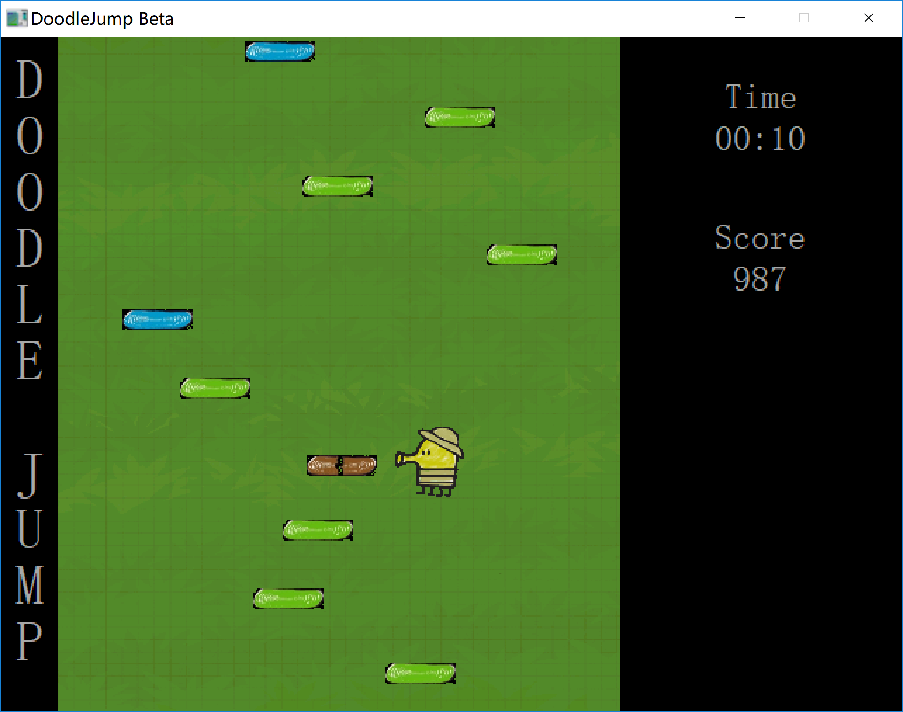

# DoodleJump

An imitation of an Android game on PC. Using C and EGE(a C++ Graphic Engine). Only for Windows.

IDE: CodeBlocks

EGE Website: http://xege.org/

Note: This program is mainly coded with C, but uses a C++ Graphic Engine(EGE).

Copyrights of images used in this game belong to orginal developers of Android game "DoodleJump".

## Preview  

